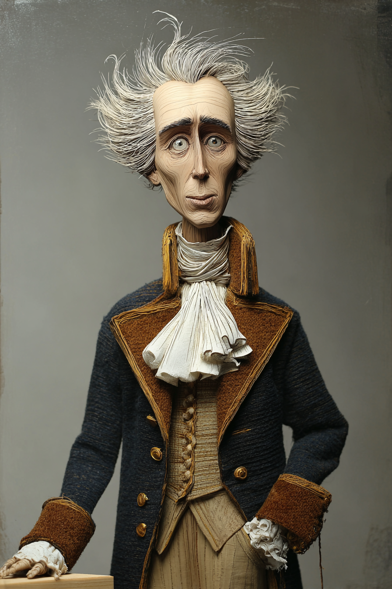

# Introductory Statistics — Wayback Sections

> Extracted from `chapters/`. Each entry corresponds to one chapter file.
> Sections are instructor-authored. Missing sections show a placeholder only.
> Do not edit this file directly — edit the source chapter file, then re-run extraction.

---

## Chapter 00: Introductory Statistics: with LLMs
*Source: `chapters/00-frontmatter.md`*

> **Section not yet authored.** No `## AI Wayback Machine` block found in this chapter file.
> To add this section, edit the source chapter file directly.

---

## Chapter 00: Introduction
*Source: `chapters/00-introduction.md`*

> **Section not yet authored.** No `## AI Wayback Machine` block found in this chapter file.
> To add this section, edit the source chapter file directly.

---

## Chapter 01: Chapter 1 — Sampling and Data
*Source: `chapters/01-sampling-and-data.md`*

##  AI Wayback Machine
**Florence Nightingale David** was a 20th-century British statistician — Karl Pearson's protégée — whose work on combinatorial probability and survey sampling is still cited.


*Puppet Art by [Nik Bear Brown](https://www.nikbearbrown.com/).*

**Run this:**

```
Who is Florence Nightingale David, and how does their work connect
to sampling and data we covered in this chapter? Keep it to three
paragraphs. End with the single most surprising thing about their
career or ideas.
```

→ Search **"Florence Nightingale David"** on Wikipedia.

**Now make the prompt better.** Try one of these:

- Ask it to apply Florence Nightingale David's framework to a small dataset you actually have.
- Add a constraint: "Answer including criticisms or limits of Florence Nightingale David's framework."

What changes? What gets better? What gets worse?

---

## Chapter 02: Chapter 2 — Descriptive Statistics
*Source: `chapters/02-descriptive-statistics.md`*

##  AI Wayback Machine
**John Tukey** invented exploratory data analysis — the framework underlying every modern look at a dataset.

**Run this:**

```
Who is John Tukey, and how does their work connect to descriptive statistics we covered in this chapter? Keep it to three paragraphs. End with the single most surprising thing about their career or ideas.
```

→ Search **"John Tukey"** on Wikipedia.

**Now make the prompt better.** Try one of these:

- Ask it to apply John Tukey's framework to a small dataset you actually have.
- Add a constraint: "Answer including criticisms or limits of John Tukey's framework."

What changes? What gets better? What gets worse?

---

## Chapter 03: Chapter 3 — Probability Topics
*Source: `chapters/03-probability-topics.md`*

##  AI Wayback Machine


*Puppet Art by [Nik Bear Brown](https://www.nikbearbrown.com/).*

**Run this:**

```
Who is Andrey Kolmogorov, and how does their work connect to probability we covered in this chapter? Keep it to three paragraphs. End with the single most surprising thing about their career or ideas.
```

→ Search **"Andrey Kolmogorov"** on Wikipedia.

**Now make the prompt better.** Try one of these:

- Ask it to apply Andrey Kolmogorov's framework to a small dataset you actually have.
- Add a constraint: "Answer including criticisms or limits of Andrey Kolmogorov's framework."

What changes? What gets better? What gets worse?

---

## Chapter 04: Chapter 4 — Discrete Random Variables
*Source: `chapters/04-discrete-random-variables.md`*

##  AI Wayback Machine
**Siméon Denis Poisson** was a French mathematician whose 1837 work on the distribution bearing his name underlies modern modeling of rare events.

**Run this:**

```
Who is Siméon Denis Poisson, and how does their work connect to
discrete random variables we covered in this chapter? Keep it to
three paragraphs. End with the single most surprising thing about
their career or ideas.
```

→ Search **"Siméon Denis Poisson"** on Wikipedia.

**Now make the prompt better.** Try one of these:

- Ask it to apply Siméon Denis Poisson's framework to a small dataset you actually have.
- Add a constraint: "Answer including criticisms or limits of Siméon Denis Poisson's framework."

What changes? What gets better? What gets worse?

---

## Chapter 05: Chapter 5 — Continuous Random Variables
*Source: `chapters/05-continuous-random-variables.md`*

##  AI Wayback Machine
**Abraham de Moivre** derived the normal approximation to the binomial in 1733 — the first appearance of the normal distribution in print.

**Run this:**

```
Who is Abraham de Moivre, and how does their work connect to continuous random variables we covered in this chapter? Keep it to three paragraphs. End with the single most surprising thing about their career or ideas.
```

→ Search **"Abraham de Moivre"** on Wikipedia.

**Now make the prompt better.** Try one of these:

- Ask it to apply Abraham de Moivre's framework to a small dataset you actually have.
- Add a constraint: "Answer including criticisms or limits of Abraham de Moivre's framework."

What changes? What gets better? What gets worse?

---

## Chapter 06: Chapter 6 — The Normal Distribution
*Source: `chapters/06-the-normal-distribution.md`*

##  AI Wayback Machine
**Carl Friedrich Gauss** was a mathematician whose 1809 work on least squares put the normal distribution at the center of statistical practice.

**Run this:**

```
Who is Carl Friedrich Gauss, and how does their work connect to the normal distribution we covered in this chapter? Keep it to three paragraphs. End with the single most surprising thing about their career or ideas.
```

→ Search **"Carl Friedrich Gauss"** on Wikipedia.

**Now make the prompt better.** Try one of these:

- Ask it to apply Carl Friedrich Gauss's framework to a small dataset you actually have.
- Add a constraint: "Answer including criticisms or limits of Carl Friedrich Gauss's framework."

What changes? What gets better? What gets worse?

---

## Chapter 07: Chapter 7 — The Central Limit Theorem
*Source: `chapters/07-the-central-limit-theorem.md`*

##  AI Wayback Machine
**Pierre-Simon Laplace** extended de Moivre's normal approximation to arbitrary distributions in 1810 — the first general central limit theorem.



*Puppet Art by [Nik Bear Brown](https://www.nikbearbrown.com/).*

**Run this:**

```
Who is Pierre-Simon Laplace, and how does their work connect to
the central limit theorem we covered in this chapter? Keep it to
three paragraphs. End with the single most surprising thing about
their career or ideas.
```

→ Search **"Pierre-Simon Laplace"** on Wikipedia.

**Now make the prompt better.** Try one of these:

- Ask it to apply Pierre-Simon Laplace's framework to a small dataset you actually have.
- Add a constraint: "Answer including criticisms or limits of Pierre-Simon Laplace's framework."

What changes? What gets better? What gets worse?

---

## Chapter 08: Chapter 8 — Confidence Intervals
*Source: `chapters/08-confidence-intervals.md`*

##  AI Wayback Machine

**Run this:**

```
Who is Jerzy Neyman, and how does their work connect to confidence intervals we covered in this chapter? Keep it to three paragraphs. End with the single most surprising thing about their career or ideas.
```

→ Search **"Jerzy Neyman"** on Wikipedia.

**Now make the prompt better.** Try one of these:

- Ask it to apply Jerzy Neyman's framework to a small dataset you actually have.
- Add a constraint: "Answer including criticisms or limits of Jerzy Neyman's framework."

What changes? What gets better? What gets worse?

---

## Chapter 09: Chapter 9 — Hypothesis Testing with One Sample
*Source: `chapters/09-hypothesis-testing-with-one-sample.md`*

##  AI Wayback Machine
**William Gosset** wrote as "Student" while working at Guinness — and introduced the t-test in 1908 to handle small-sample inference.

**Run this:**

```
Who is William Gosset, and how does their work connect to hypothesis testing we covered in this chapter? Keep it to three paragraphs. End with the single most surprising thing about their career or ideas.
```

→ Search **"William Gosset"** on Wikipedia.

**Now make the prompt better.** Try one of these:

- Ask it to apply William Gosset's framework to a small dataset you actually have.
- Add a constraint: "Answer including criticisms or limits of William Gosset's framework."

What changes? What gets better? What gets worse?

---

## Chapter 10: Chapter 10 — Hypothesis Testing with Two Samples
*Source: `chapters/10-hypothesis-testing-with-two-samples.md`*

##  AI Wayback Machine
**Frank Wilcoxon** was a chemist whose rank-based two-sample test (1945) became one of the most-used nonparametric techniques in modern statistics.


*Puppet Art by [Nik Bear Brown](https://www.nikbearbrown.com/).*

**Run this:**

```
Who is Frank Wilcoxon, and how does their work connect to
two-sample tests we covered in this chapter? Keep it to three
paragraphs. End with the single most surprising thing about their
career or ideas.
```

→ Search **"Frank Wilcoxon"** on Wikipedia.

**Now make the prompt better.** Try one of these:

- Ask it to apply Frank Wilcoxon's framework to a small dataset you actually have.
- Add a constraint: "Answer including criticisms or limits of Frank Wilcoxon's framework."

What changes? What gets better? What gets worse?

---

## Chapter 11: Chapter 11 — The Chi-Square Distribution
*Source: `chapters/11-the-chi-square-distribution.md`*

##  AI Wayback Machine
**Karl Pearson** introduced the chi-square test in 1900 — and built the foundations of biometric statistics, with a controversial eugenics legacy.

**Run this:**

```
Who is Karl Pearson, and how does their work connect to the chi-square distribution we covered in this chapter? Keep it to three paragraphs. End with the single most surprising thing about their career or ideas.
```

→ Search **"Karl Pearson"** on Wikipedia.

**Now make the prompt better.** Try one of these:

- Ask it to apply Karl Pearson's framework to a small dataset you actually have.
- Add a constraint: "Answer including criticisms or limits of Karl Pearson's framework."

What changes? What gets better? What gets worse?

---

## Chapter 12: Chapter 12 — The F-Distribution and One-Way ANOVA
*Source: `chapters/12-f-distribution-and-one-way-anova.md`*

##  AI Wayback Machine
**Ronald Fisher** invented analysis of variance, the F-distribution, and the core machinery of modern experimental statistics — with an entangled eugenics legacy.


*Puppet Art by [Nik Bear Brown](https://www.nikbearbrown.com/).*

**Run this:**

```
Who is Ronald Fisher, and how does their work connect to ANOVA and the F-distribution we covered in this chapter? Keep it to three paragraphs. End with the single most surprising thing about their career or ideas.
```

→ Search **"Ronald Fisher"** on Wikipedia.

**Now make the prompt better.** Try one of these:

- Ask it to apply Ronald Fisher's framework to a small dataset you actually have.
- Add a constraint: "Answer including criticisms or limits of Ronald Fisher's framework."

What changes? What gets better? What gets worse?

---

## Chapter 13: Chapter 13 — Linear Regression and Correlation
*Source: `chapters/13-linear-regression-and-correlation.md`*

##  AI Wayback Machine
**Gertrude Cox** was the first woman to chair a statistics department in the US — at North Carolina State — and a pioneer of experimental design and regression methods.

**Run this:**

```
Who is Gertrude Cox, and how does their work connect to regression and correlation we covered in this chapter? Keep it to three paragraphs. End with the single most surprising thing about their career or ideas.
```

→ Search **"Gertrude Cox"** on Wikipedia.

**Now make the prompt better.** Try one of these:

- Ask it to apply Gertrude Cox's framework to a small dataset you actually have.
- Add a constraint: "Answer including criticisms or limits of Gertrude Cox's framework."

What changes? What gets better? What gets worse?

---

## Chapter 99: 99 Back Matter
*Source: `chapters/99-back-matter.md`*

> **Section not yet authored.** No `## AI Wayback Machine` block found in this chapter file.
> To add this section, edit the source chapter file directly.

---
